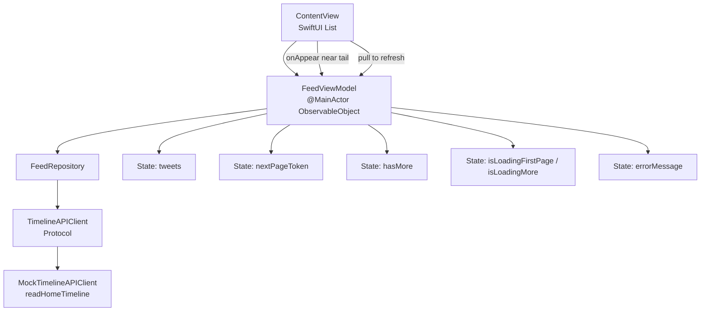
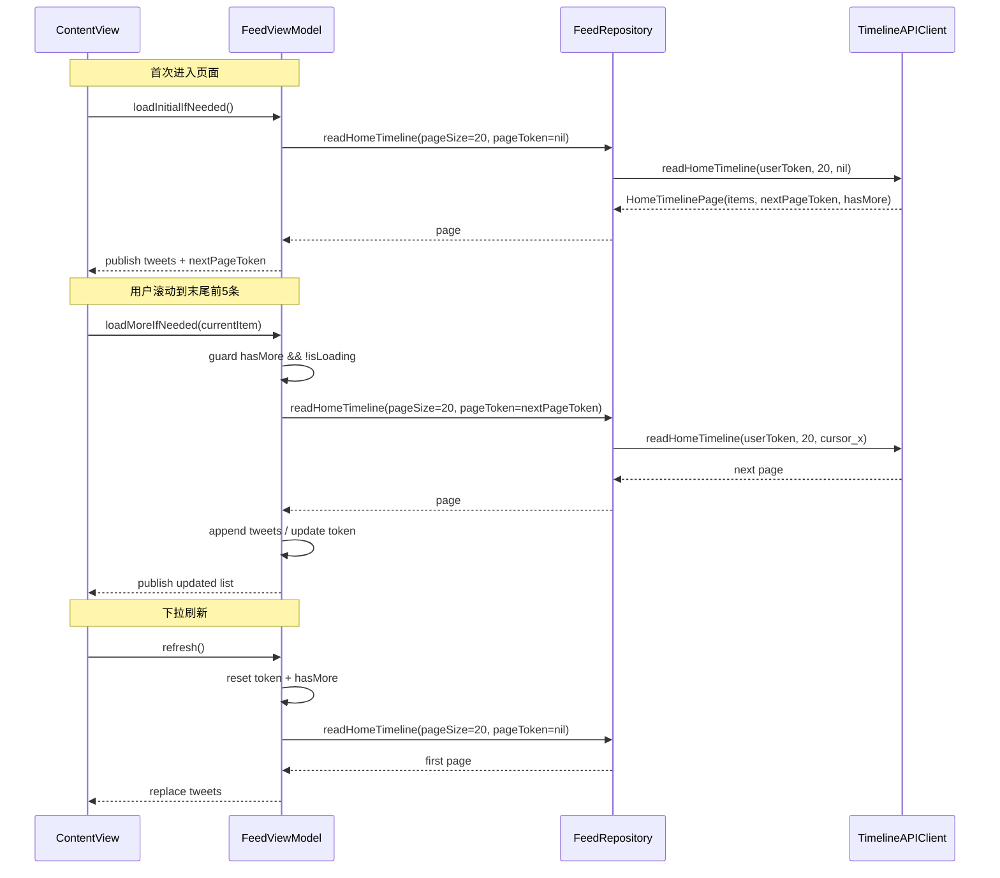
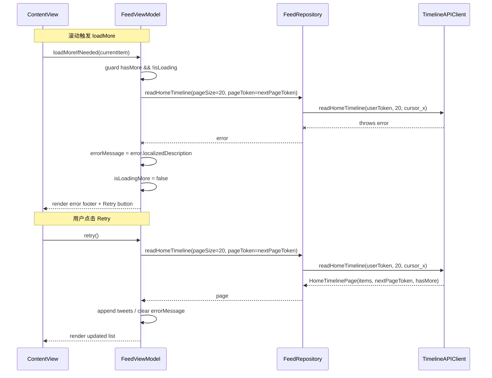

# Pagination 架构图（SwiftUI + MVVM）

## 1) 组件架构图

## 2) 无限滚动时序图

## 3) 触发规则（当前实现）

1. 默认 `pageSize = 20`
2. 当当前 cell 进入末尾前 5 条，触发 `loadMoreIfNeeded`
3. 并发保护：`hasMore && !isLoadingFirstPage && !isLoadingMore`
4. 刷新时重置游标，再从第一页加载

## 4) 错误重试分支时序图

